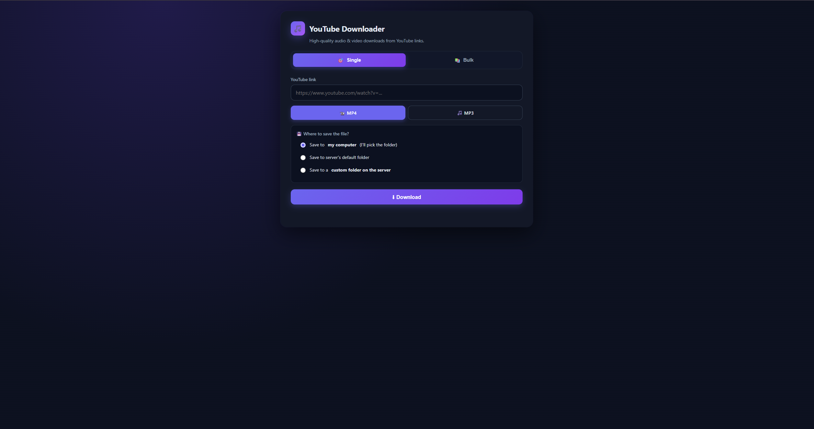
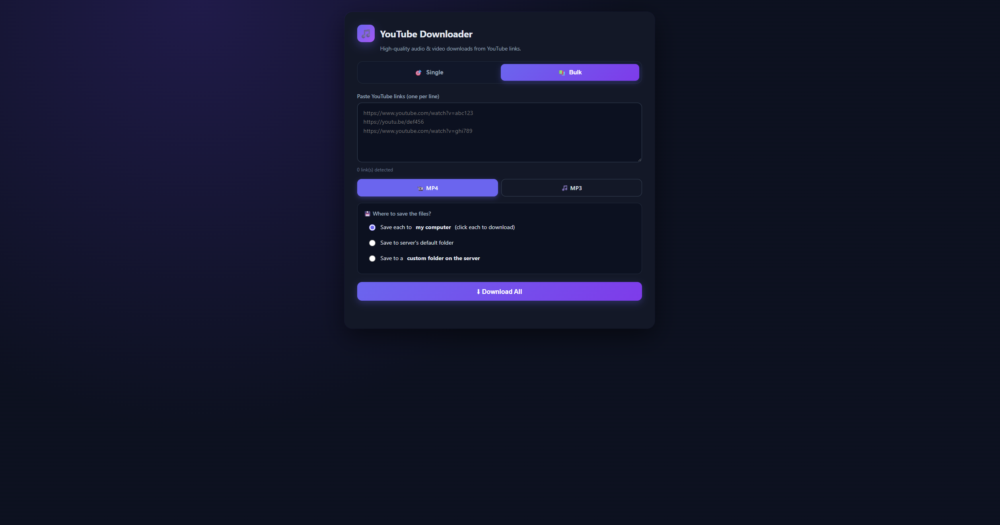
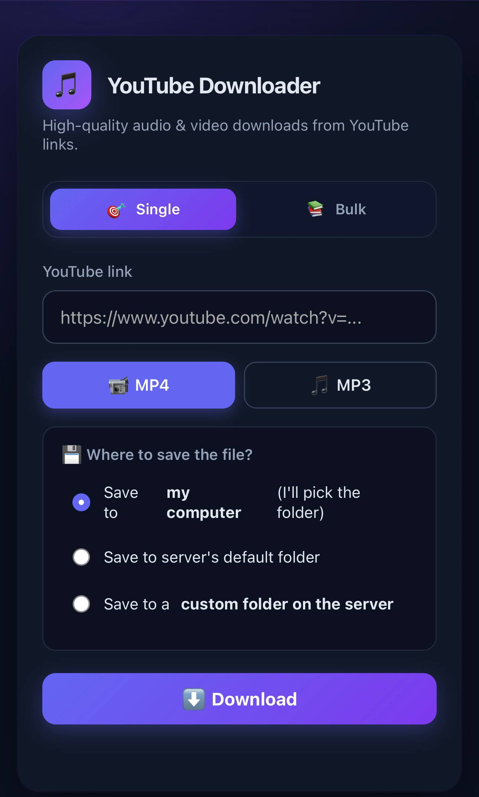

# 🎵 YouTube Downloader

> A modern, self-hosted web app to download YouTube videos as **MP4** or **high-quality MP3 (up to 320 kbps)** — with batch support, folder picking, and a clean dark UI.


---

## 📖 Table of Contents

- [Features](#-features)
- [Screenshots](#-screenshots)
- [Quick Start](#-quick-start)
- [Project Structure](#-project-structure)
- [Usage](#-usage)
- [Access from Your Phone (LAN)](#-access-from-your-phone-lan)
- [Configuration](#-configuration)
- [Troubleshooting](#-troubleshooting)
- [Tech Stack](#-tech-stack)
- [Legal Notice](#️-legal-notice)
- [FAQ](#-faq)
- [Contributing](#-contributing)
- [License](#-license)
- [Acknowledgments](#-acknowledgments)

---

## ✨ Features

### Core
- 🎯 **Single Download** — paste one YouTube link, pick MP4 or MP3
- 📚 **Bulk Download** — paste many links (one per line), download them all at once
- 🔊 **High-Quality Audio** — choose 128 / 192 / 256 / **320 kbps** MP3
- 🖼️ **Auto Cover Art** — thumbnails + metadata (title/artist) embedded into every MP3

### Save Options
- 💾 **Flexible Save Options**
  - Save to **your computer** (browser download, or Chrome/Edge folder picker)
  - Save to the **server's default folder**
  - Save to a **custom folder** on the server
- 💚 **Save All** button — grab every finished file from a bulk job in one click

### Experience
- 📊 **Live Progress** — real-time percent, speed, ETA, and per-item status
- 🎨 **Modern Dark UI** — responsive, mobile-friendly, animated progress bars
- ⚡ **Smart Concurrency** — throttled to 2 parallel downloads to avoid YouTube CDN timeouts
- 🔁 **Auto Retries** — resilient to slow networks and CDN hiccups
- 📱 **LAN Access** — use it from your phone on the same Wi-Fi

---

## 📸 Screenshots

> _Add your screenshots to a `docs/` folder and update the paths below. If you don't want screenshots, delete this section._

| Single Tab | Bulk Tab |
| :-: | :-: |
|  |  |

| Mobile View |
| :-: |
|  |

---

## 🚀 Quick Start

### Prerequisites

You'll need three tools installed:

| Tool | Why | Minimum |
|---|---|---|
| **Python** | Runs the app | 3.10+ |
| **FFmpeg** | Merges video/audio & converts to MP3 | Any recent version |
| **Deno** | JS runtime required by yt-dlp for YouTube | Any recent version |

#### Install Python

- **Windows:** [python.org/downloads](https://www.python.org/downloads/) — tick "Add Python to PATH"
- **macOS:** `brew install python@3.12`
- **Linux:** `sudo apt install python3 python3-venv python3-pip`

Verify: `python --version` (should show 3.10+)

#### Install FFmpeg

- **Windows:** `winget install Gyan.FFmpeg`
- **macOS:** `brew install ffmpeg`
- **Linux (Debian/Ubuntu):** `sudo apt install ffmpeg`

Verify: `ffmpeg -version`

#### Install Deno

- **Windows:** `winget install DenoLand.Deno`
- **macOS:** `brew install deno`
- **Linux:** `curl -fsSL https://deno.land/install.sh | sh`

Verify: `deno --version`

> ⚠️ **Restart your terminal** after installing FFmpeg and Deno so PATH updates take effect.

### Clone & Run

```bash
# 1. Clone the repository
git clone https://github.com/whospiko/youtube-downloader.git
cd youtube-downloader

# 2. Create and activate a virtual environment
python -m venv .venv
source .venv/bin/activate        # Windows PowerShell: .venv\Scripts\activate
                                 # Windows CMD:        .venv\Scripts\activate.bat

# 3. Install dependencies
pip install -r requirements.txt

# 4. Run the app
python app.py
```

Then open **http://localhost:5001** in your browser.

The terminal will print something like:

```
=======================================================
  📱  Open on your phone:  http://192.168.100.162:5001
  💻  On this computer:    http://127.0.0.1:5001
=======================================================
```

---

## 📁 Project Structure

```
youtube-downloader/
├── app.py                  # Flask backend + yt-dlp logic
├── requirements.txt        # Python dependencies
├── templates/
│   └── index.html          # Single-page UI (Single + Bulk tabs)
├── downloads/              # Default output folder (auto-created on first run)
├── docs/                   # Screenshots for README (optional)
│   ├── single.png
│   ├── bulk.png
│   └── mobile.png
└── README.md
```

---

## 📖 Usage

### Single Download

1. Open the **Single** tab.
2. Paste a YouTube URL into the input field.
3. Pick **MP4** (video) or **MP3** (audio only).
4. If **MP3**, pick a bitrate — default **320 kbps** is best.
5. Choose where to save the file:
   - **Save to my computer** — browser will download it (you can also click "📁 pick a folder" in Chrome/Edge to choose a destination directly)
   - **Server's default folder** — saves to `./downloads/` on the machine running the app
   - **Custom folder on the server** — type a path like `D:\Music` or `/home/user/Music`
6. Click **⬇ Download**.
7. Watch the progress bar; when done, click **Save** or use the folder picker.

### Bulk Download

1. Open the **Bulk** tab.
2. Paste YouTube links, **one per line**.
   - Duplicates are removed automatically.
   - Invalid links are shown in a red warning box and skipped.
3. Pick format and quality (same as Single).
4. Choose save location (same as Single).
5. Click **⬇ Download All**.
6. Each link gets its own progress card with status badge:
   - `queued` → waiting for a free slot
   - `downloading` → active (with live speed)
   - `processing` → FFmpeg converting/merging
   - `done` → ready to save
   - `error` → something failed
7. When items finish, click **💾 Save All N Files** — the folder picker saves everything into one folder at once (Chrome/Edge), or triggers sequential downloads (Firefox).

---

## 📱 Access from Your Phone (LAN)

Run the app on your PC, use it from your phone's browser over Wi-Fi.

### Steps

1. Make sure your **phone and PC are on the same Wi-Fi network**.
2. Start the app on your PC: `python app.py`
3. Note the phone URL printed on startup (e.g., `http://192.168.100.162:5001`).
4. Open that URL on your phone's browser.

> ⚠️ Type **`http://`** — not `https://`. Flask's dev server is HTTP-only.

### If it doesn't load

**99% of the time it's the firewall.** Allow Python through it:

**GUI method:**
1. Windows Security → Firewall & network protection
2. Allow an app through firewall → Change settings → Allow another app
3. Browse to `.venv\Scripts\python.exe` in your project
4. Tick **Private** and **Public** → Add

**PowerShell method** (run as Administrator):

```powershell
New-NetFirewallRule -DisplayName "Flask YouTube Downloader" -Direction Inbound -LocalPort 5001 -Protocol TCP -Action Allow
```

### Common LAN gotchas

| Problem | Fix |
|---|---|
| Phone on mobile data | Switch to Wi-Fi |
| Guest network isolated | Connect both to the main SSID |
| IP changed after reboot | Run `ipconfig` and use the new IP |
| Debug reloader drops connection | Set `debug=False` in `app.py` while testing |
| VPN running on PC | Pause VPN — it may block LAN |

### Auto-print the phone URL on startup

Replace the `if __name__ == "__main__":` block in `app.py` with:

```python
import socket

def get_local_ip():
    try:
        s = socket.socket(socket.AF_INET, socket.SOCK_DGRAM)
        s.connect(("8.8.8.8", 80))
        ip = s.getsockname()[0]
        s.close()
        return ip
    except Exception:
        return "127.0.0.1"

if __name__ == "__main__":
    ip = get_local_ip()
    print("\n" + "=" * 55)
    print(f"  📱  Open on your phone:  http://{ip}:5001")
    print(f"  💻  On this computer:    http://127.0.0.1:5001")
    print("=" * 55 + "\n")
    app.run(host="0.0.0.0", port=5001, debug=True)
```

---

## 🔧 Configuration

### Change the port

In `app.py`, edit the last line:

```python
app.run(host="0.0.0.0", port=5001, debug=True)
```

Common alternative ports: `5002`, `8000`, `8080`.

> Port **5000** is often reserved by Windows (Hyper-V/WSL2) or macOS (AirPlay Receiver). Use 5001 or higher.

### Change concurrency limit

Downloads are throttled to avoid YouTube CDN timeouts. Edit `app.py`:

```python
DOWNLOAD_SEMAPHORE = threading.Semaphore(2)   # change 2 to N
```

Higher values = faster bulk jobs, but more chance of hitting CDN errors.

### Change default download folder

```python
DEFAULT_DOWNLOAD_DIR = BASE_DIR / "downloads"   # change to any path
```

---

## 🩺 Troubleshooting

| Symptom | Fix |
|---|---|
| **Port already in use / socket error** | Change port (`5001` → `5002`) |
| **`ffmpeg is not installed`** | Install FFmpeg and restart terminal |
| **`No supported JavaScript runtime`** | Install Deno and restart terminal |
| **`Please sign in` / `Precondition check failed`** | Update yt-dlp: `pip install -U yt-dlp` |
| **`Connection to googlevideo.com timed out`** | The app auto-retries 10×; if persistent, disable VPN or antivirus HTTPS scanning |
| **Phone can't reach the app** | Windows Firewall — see [LAN section](#-access-from-your-phone-lan) |
| **Audio sounds same at all bitrates** | YouTube's source is often only 128–256 kbps; higher output preserves that better but can't add detail |
| **`Unable to download API page`** | Update yt-dlp: `pip install -U yt-dlp` |

### Keep yt-dlp updated

YouTube changes its API often. Keep yt-dlp fresh:

```bash
pip install -U yt-dlp
```

The `requirements.txt` intentionally does **not** pin yt-dlp — this ensures `pip install -r requirements.txt` always grabs a working version.

### Adding cookies (for age-restricted or sign-in-required videos)

**Option A — live browser cookies:**

In `app.py`, add to `common_opts` inside `download_worker`:

```python
"cookiesfrombrowser": ("firefox",),   # or "chrome", "edge", "brave"
```

> Firefox is the most reliable on Windows.

**Option B — exported cookie file:**

1. Install a "Get cookies.txt LOCALLY" browser extension
2. Log in to YouTube, export cookies to `cookies.txt` in the project root
3. Add to `common_opts`:

```python
"cookiefile": "cookies.txt",
```

> ⚠️ Never commit `cookies.txt` — it contains session credentials.

---

## 🛠 Tech Stack

- **[Flask](https://flask.palletsprojects.com/)** — lightweight web framework
- **[yt-dlp](https://github.com/yt-dlp/yt-dlp)** — the actual download engine
- **[FFmpeg](https://ffmpeg.org/)** — audio extraction & A/V merging
- **[Deno](https://deno.land/)** — JavaScript runtime for YouTube challenge solving
- **Vanilla JS + CSS** — no build step, no dependencies

---

## ⚖️ Legal Notice

This project is intended for **personal and educational use only**.

- Downloading copyrighted content without permission may violate YouTube's [Terms of Service](https://www.youtube.com/t/terms) and copyright law in your country.
- Use this tool only for:
  - Content you own
  - Content in the public domain
  - Content with a permissive license (e.g., Creative Commons)
  - Content you have explicit permission to download
- The authors are **not responsible** for how you use this tool.

> Spotify is mentioned for **bitrate comparison only**. This tool cannot and does not access Spotify — see the [FAQ](#-faq).

---

## ❓ FAQ

**Q: Can I download from Spotify?**
No. Spotify streams are DRM-protected and their ToS forbids downloading. Any tool claiming otherwise either downloads from YouTube and mislabels it, or circumvents DRM (illegal in most countries).

**Q: What's the highest MP3 quality I can get?**
The app outputs up to **320 kbps MP3**, matching Spotify Premium's "Very High" tier. However, YouTube's source is typically 128–256 kbps AAC, so the effective ceiling is bounded by the source.

**Q: Will this work on a public server?**
Yes, but the **server-folder save options** let users write to arbitrary paths. Before exposing publicly, either:
- Remove those options, OR
- Restrict them to an allowlist of subfolders under `downloads/`

Also add rate-limiting, authentication, and HTTPS for production use.

**Q: Why is the port 5001 and not 5000?**
Port 5000 is often reserved by Windows (Hyper-V/WSL2) or macOS (AirPlay Receiver). 5001 avoids the conflict.

**Q: Can I change the output filename?**
Not from the UI yet. yt-dlp names files with an internal job ID; the friendly name is applied when you click **Save**. PRs welcome!

**Q: Does it work with YouTube playlists?**
Not currently — `noplaylist` is enabled so only the single video from a playlist URL is downloaded. Removing that flag would enable playlist support.

**Q: How many links can I paste in Bulk?**
No hard limit, but the queue downloads 2 at a time. Pasting 100+ links works but will take a while.

**Q: Are files deleted after download?**
No. Files stay in `downloads/` on the server. Add a cleanup task (e.g., cron job) if you need auto-deletion.

**Q: Can I use this on Windows, macOS, and Linux?**
Yes — the only platform-specific bits are the FFmpeg/Deno install steps, which the docs cover for all three.

---

## 🤝 Contributing

Contributions, issues, and feature requests are welcome!

1. Fork the repo
2. Create a branch: `git checkout -b feature/amazing-feature`
3. Commit: `git commit -m "Add amazing feature"`
4. Push: `git push origin feature/amazing-feature`
5. Open a Pull Request

Please test with a **public-domain** YouTube video before submitting.

### Ideas for contributions
- Playlist support
- Progress persistence (resume jobs after server restart)
- Auto-cleanup of old downloads
- Docker image
- User authentication for public deployments
- Dark/light theme toggle

---

## 📄 License

This project is licensed under the **MIT License** — see the [LICENSE](LICENSE) file for details.

```
MIT License

Copyright (c) 2026 YOUR NAME

Permission is hereby granted, free of charge, to any person obtaining a copy
of this software and associated documentation files (the "Software"), to deal
in the Software without restriction, including without limitation the rights
to use, copy, modify, merge, publish, distribute, sublicense, and/or sell
copies of the Software, and to permit persons to whom the Software is
furnished to do so, subject to the following conditions:

The above copyright notice and this permission notice shall be included in all
copies or substantial portions of the Software.

THE SOFTWARE IS PROVIDED "AS IS", WITHOUT WARRANTY OF ANY KIND, EXPRESS OR
IMPLIED, INCLUDING BUT NOT LIMITED TO THE WARRANTIES OF MERCHANTABILITY,
FITNESS FOR A PARTICULAR PURPOSE AND NONINFRINGEMENT. IN NO EVENT SHALL THE
AUTHORS OR COPYRIGHT HOLDERS BE LIABLE FOR ANY CLAIM, DAMAGES OR OTHER
LIABILITY, WHETHER IN AN ACTION OF CONTRACT, TORT OR OTHERWISE, ARISING FROM,
OUT OF OR IN CONNECTION WITH THE SOFTWARE OR THE USE OR OTHER DEALINGS IN THE
SOFTWARE.
```

> Replace `YOUR NAME` with your name or GitHub handle.

---

## 🙏 Acknowledgments

- [yt-dlp](https://github.com/yt-dlp/yt-dlp) — the engine that makes this possible
- [FFmpeg](https://ffmpeg.org/) — audio/video processing
- [Deno](https://deno.land/) — modern JS runtime
- [Flask](https://flask.palletsprojects.com/) — simple, powerful web framework
- All contributors and users of this project

---

## ⭐ Show Your Support

If this project helped you, please give it a ⭐ on GitHub — it means a lot!

---

<p align="center">Made with ❤️ and Python</p>